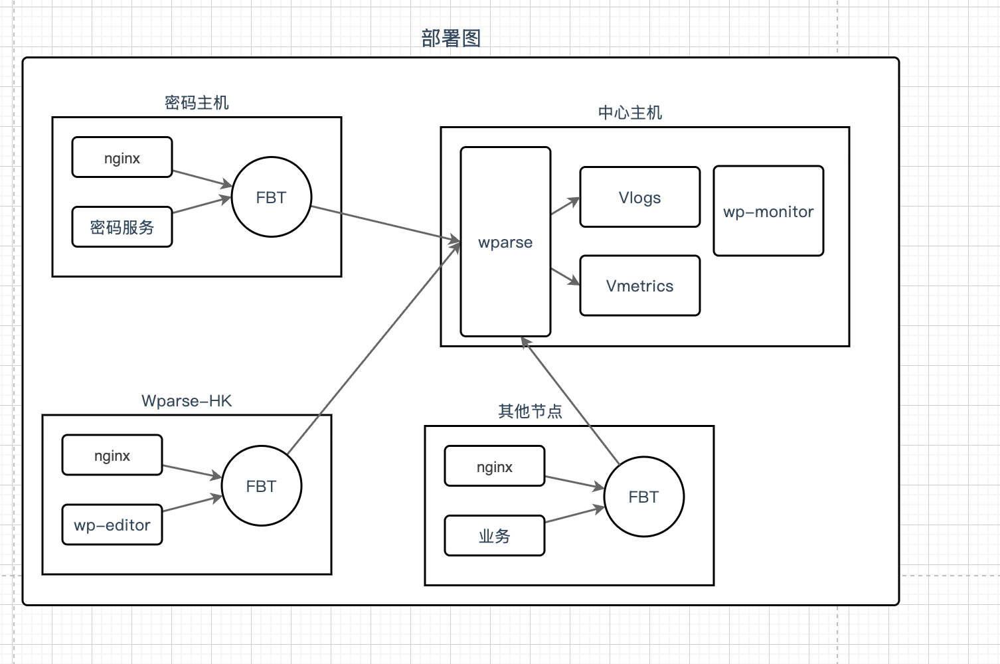
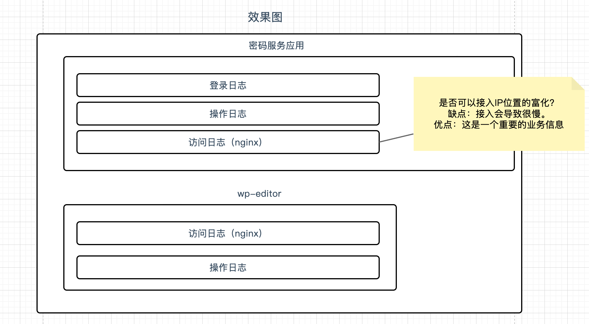
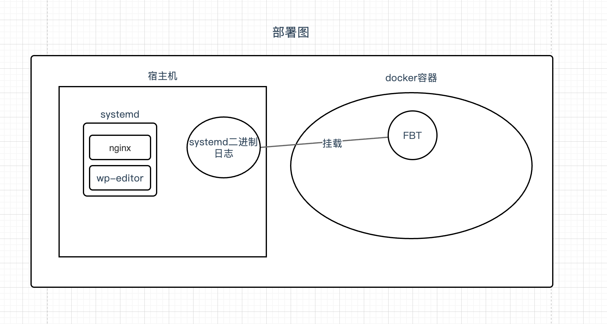
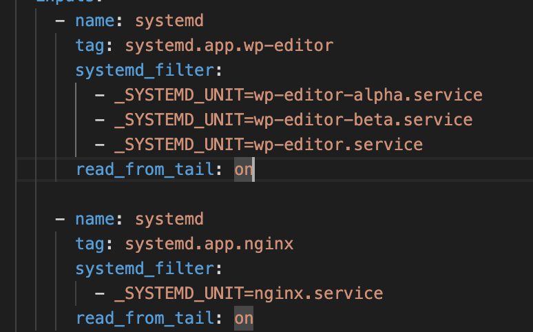
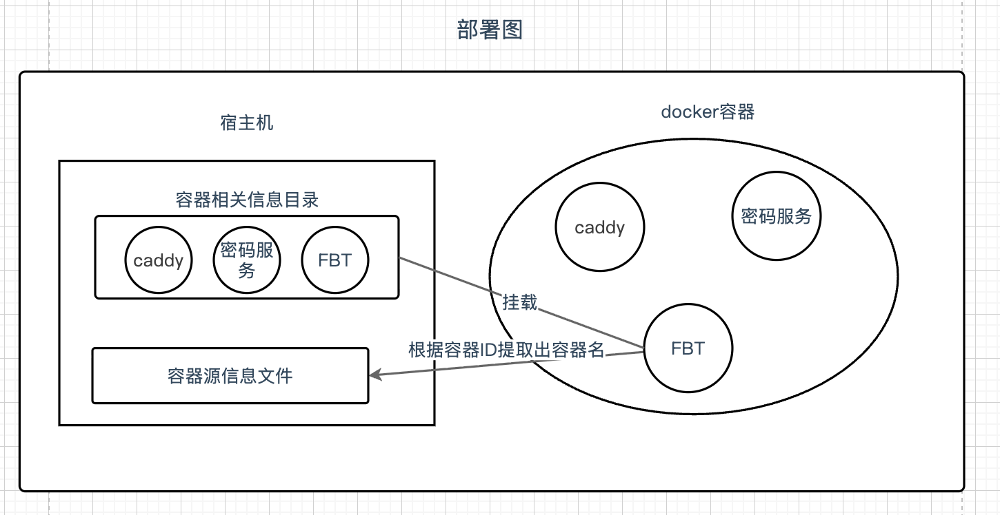

## 项目简介

这是大禹安全的业务日志监控项目。

项目当前覆盖三台主机：

- `centre-host`：中心节点，负责日志接入、解析、存储和监控展示
- `editor-host`：wparse的editor服务节点
- `password-host`：密码服务节点




## 各节点纳管情况 
### editor-host
当前主机监控服务：
- wp-editor: wparse工具
- nginx

两个服务均以systemctl部署,fluent-bit以容器方式部署：


相关挂载配置:
```
    # 宿主机日志目录
    - /var/log:/var/log:ro
    # systemd所需的目录
    - /etc/machine-id:/etc/machine-id:ro
```

依据Systemd的unit字段进行采集,其中我将三个版本的editor，定义为同一个app_name。


[systemd字段相关介绍](https://www.systutorials.com/docs/linux/man/7-systemd.journal-fields/)


### password-host
当前主机监控服务：
- Vaultwarden:密码管理服务
- caddy: 类似与nginx的反向代理服务

两个服务以及fluent-bit均以docker方式部署:


依据容器名作为采集依据，不过容器的日志文件中，并没有容器名，所以需要额外使用脚本从其他文件中提取出容器名，为了避免每条日志都从外部提取容器名，我提供了一个LRU缓存，存储最近的容器名，LRU默认大小为1024，具体请看`password-host/script`


### centre-host
该主机为接收外部日志的主机。
目前对于Vaultwarden和wp-editor日志，区分的比较粗。之后再细化。